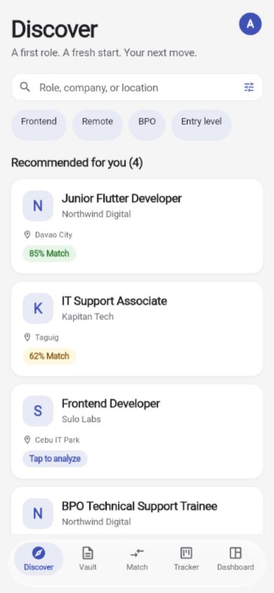
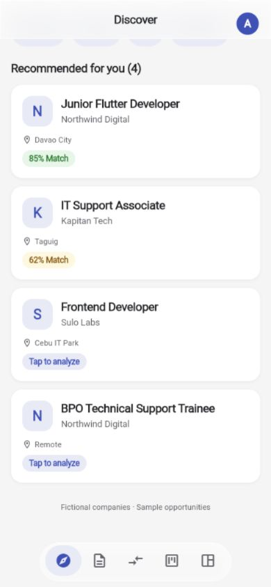

# Navigation and UI review, 2 October 2026

## Changes

- Fixed the expanding `Center` inside bottom navigation by giving its alignment an intrinsic height. The bar now sits at the bottom of the phone viewport.
- Reserved navigation space in the scaffold instead of drawing it over content. Removed redundant 120–130px bottom padding from the tab screens.
- Phone navigation now narrows to an icon-only capsule on a deliberate downward scroll, as requested. Upward scrolling, returning near the top, or switching tabs restores labels. A fixed navigation slot prevents scroll jumps while the surface animates. Compact icons retain tooltips, accessible names, and at least 44px targets. Enlarged labels scroll horizontally in the expanded state.
- Added a compact rail at tablet widths and an extended rail on desktop. Short landscape windows retain bottom navigation so the rail cannot overflow vertically. Main content is limited to 960px for readable line lengths.
- Used persistent router branches so switching tabs preserves search text, filters, form state, and scroll positions. Detail screens return to the previous tab state.
- Replaced the Tracker's manually offset add control with a labelled floating action button positioned by the scaffold.
- Added keyboard focus, Enter/Space activation, pointer cursors, disabled semantics, and minimum 44px targets to shared pressable controls. Navigation exposes one labelled control per destination with selected state.
- Measured expanded headers using the available width and text scale. Fixed overflowing location, resume-selection, status, and history rows with wrapping or stacking.
- Improved muted text in both themes and used a lighter indigo foreground for dark-theme text/icons, retaining the darker action fill for white button labels.
- Replaced the fabricated selected-resume fallback with an explicit prompt when there is no selection. Added accessible labels to custom Back and sheet Close controls.
- Corrected the visual tests to set the actual viewport and pixel ratio, rather than changing only the test surface.

## Design decisions

Reading this as a job-search workspace with the repository's existing indigo palette, system typography, rounded surfaces, and clear task labels. ENERGY 1 / RHYTHM 1 / MOTION 1.

- Indigo continues to identify actions and selection; its lighter dark-theme foreground improves readability without changing the button fill.
- Persistent bottom navigation supports phone use; a rail makes the same destinations accessible in wider windows without stretching the bar.
- System typography remains familiar; measured headers support text resizing instead of clipping.
- Content-sized spacing replaces navigation compensation because the scaffold now reserves the required space.
- Cards continue to group individual jobs, resumes, and applications. Metadata stacks when text no longer fits beside the title.
- Existing destination icons identify jobs, documents, matching, tracking, and dashboard views. No new branding assets were created.

## Verification

The original review passed 31 tests and production web compilation. The scroll-navigation follow-up adds regression checks for minimize/restore, stable page height, compact tap targets, and cancellation of pending search updates when clearing the field.

The follow-up also separates the loading screen from routing, preventing an unresolved-initial-route warning when opening a saved tab URL. A deferred-repository test verifies that loading `/tracker` waits for initialization and then selects Tracker without a route exception.

Final follow-up verification: **34 tests passed**, analysis reported **no issues**, and a fresh browser load of `/discover` rendered correctly with **no warning/error logs**. The navigation changes also compiled successfully in the production web build.

The layout matrix covers 320×568, 390×844, 768×1024, 1280×800, and 844×390, in light/dark themes at 100% and 200% text. Each case visits all five tabs and scrolls their content. Additional checks cover navigation bounds, bottom safe-area clearance, hiding navigation with a keyboard inset, search persistence across tabs and a detail round-trip, and Enter/Space activation plus disabled controls.

Browser interaction evidence:

- Discover → displayed the job list; typing “Flutter” → one matching role.
- Vault → displayed resume metadata and selection controls.
- Tracker → displayed application stages and cards; Add application → opened the input sheet; Escape → dismissed it.
- Dashboard → displayed derived application counts and sample history.
- Match → displayed job input, resume selection, and comparison controls.
- Profile → opened settings; Light → changed the rendered theme; Back → returned to Discover.
- Desktop resize → displayed the extended side rail and constrained content.
- Phone resize → displayed labelled bottom navigation clear of the content area.
- Downward phone scrolling → labels disappeared and the surface became narrower and shorter; upward scrolling → full labels returned. All five accessible destination names remained present in the compact state.
- No browser warning/error logs were observed during this check.

## Delivery gate for this change

- R-02 PASS: new interface labels contain no em dashes.
- R-03 PASS: all five tab layouts and their scrolled content passed the viewport/text-scale matrix without render exceptions.
- R-17/R-18/R-36/R-38 PASS: no statistics, testimonials, identities, or product claims were fabricated; existing fixtures remain demo content.
- R-23 PASS: navigation retains the five existing destinations; no logo, avatar, or illustration assets were invented. The captured image is a screenshot of the running app.
- R-24 PASS: each destination resolves to its existing tab.
- R-25 PASS for the modified foreground pairs: muted light text on #F5F5F5 is 5.47:1; muted dark text on #2C2C2E is 5.42:1; dark indigo foreground on #202230 is 7.60:1, computed with the skill's contrast checker.
- R-26/R-32 PASS for the changed controls: navigation activates its destination, the add control opens its sheet, shared pressables respond to Enter/Space and show a focus border, disabled controls do not activate, and Back/Close controls have labels.
- R-27 PASS by source inspection: the existing shared scenario wrapper supplies loading, empty, and retryable error states for tab data views.
- R-28 PASS: no FAQ content was added.
- R-33 PASS: source edits used explicit patches, with Dart formatting afterward.
- R-34 PASS for reviewed tab layouts: light/dark screenshot checks and the entire layout matrix passed.
- R-35 PASS for the reviewed scope: ran the app, tests, analysis, production web compilation, and the interaction checks recorded above.
- R-37 PASS: retained the repository's visual direction and recorded the layout/contrast decisions above.
- Purpose gate PASS: navigation glass separates controls from content; selection backgrounds communicate the active destination; motion is limited to interaction feedback. No decorative effects, new icon system, or marketing sections were added.
- Liveliness/quality PASS for the changes: retained the app's established palette, task hierarchy, system typography, and content-led cards; spacing and stacking now follow available space.

Follow-up UX decisions: scroll direction and a 24px movement threshold prevent jitter; shrinking the surface while reserving its layout height prevents the content from jumping; resetting the bar on tab changes makes the new destination easy to identify. The user explicitly requested icon-only navigation during downward scrolling. The accessibility skill guided the retained names, tooltips, and touch targets. Motion respects the system's reduced-animation preference. Filter chips now expose selected states, and search clearing cancels stale debounced queries. R-03/R-24/R-26/R-32/R-34/R-35 PASS for the follow-up scope: the compact navigation passed the layout matrix and interaction tests, accessible names remain available, and down/up scroll transitions were verified in the browser. R-19/R-31 PASS: the transition responds to reading direction and keeps the page stationary rather than adding decorative motion.

Scope: shared navigation and controls, five main tab layouts, and defects encountered in the detail round-trip. This is not a certification of every nested workflow or real-device native keyboard behavior. File picking and external integrations were not exercised in the browser.

