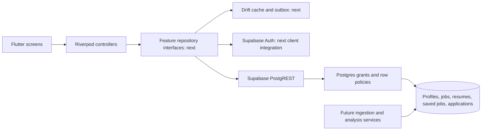

# Backend implementation

Status: database foundation, October 3, 2026. This document describes implemented
behavior. `BACKEND_PLAN.md` remains a roadmap; its provider prices, SDK versions,
performance estimates and compliance claims are not acceptance criteria.

## Boundaries



Supabase supplies authentication and the generated database API. This phase adds
versioned SQL migrations, explicit grants, owner policies, and behavioral tests.
No separate HTTP server is necessary for ordinary CRUD. External job feeds and AI
providers will live behind Edge Functions, with credentials kept on the server.

The existing `DemoRepository` serializes an entire fixture workspace. Do not use
it as the remote persistence contract: it includes simulated login, client-editable
quota, and fixture IDs. The current Flutter app continues using this demo boundary.

## Implemented data contract

| Table | Client capabilities | Ownership and constraints |
| --- | --- | --- |
| profiles | Read own profile; edit name, headline, location, target roles | Auth insert creates an empty profile; account deletion cascades |
| jobs | Read active, unexpired listings when authenticated | Server writes only; unique source/source ID; paired salary bounds |
| resumes | Create metadata, read, rename, delete | Owner only; ATS result cannot be written by client |
| saved_jobs | Read, insert, delete | Owner only; one row per user/job pair |
| applications | Create, read, edit, delete | Owner only; validated stages; immutable ownership and server version |

IDs are UUIDs. SQL columns use snake_case; existing Dart enums keep their current
values (`onSite`, `fullTime`, `wishlist`, etc.). Timestamps use `timestamptz` and
should cross the API as ISO 8601 values. Display relative posting time in Flutter
from `published_at`; do not persist `postedDays`. Email belongs to Auth. Theme and
transparency remain device preferences. No client-controlled quota exists here.

Applications copy company, role and location so the tracker survives removal of a
catalog job. `job_id` is optional for manually entered jobs. `applied_at` is nullable
for wishlist entries; the existing Dart model will need to represent that before
being used as a remote DTO. Match scores are absent until analysis results exist.

Resume records contain metadata only. There is no file bucket, raw resume text,
upload endpoint, or analysis operation in this phase. Deleting an auth user removes
these database records; future object storage and external services will require
an explicit deletion workflow too.

## First API flow

After starting local Supabase, create a test user through Auth or Studio and obtain
their access token. Use the local publishable/anon key from `npx supabase status`
as `apikey`, and the user's access token as `Authorization: Bearer <token>`.

1. `GET /rest/v1/profiles?select=*` returns only that user's auto-created profile.
2. `POST /rest/v1/applications` with `Prefer: return=representation` and JSON
   `{"company":"Example company","role":"Developer","stage":"wishlist"}`
   creates an owned application with version 1. Omit `user_id`; the database derives it.
3. `PATCH /rest/v1/applications?id=eq.<uuid>&version=eq.1`, with
   `Prefer: return=representation` and `{"stage":"applied","applied_at":"2026-10-03T00:00:00Z"}`,
   returns version 2. An empty returned array means the record was changed, deleted,
   or is inaccessible. Refetch before deciding whether to retry.
4. Sign in as a different test user: the application does not appear in their reads.

The database increments versions, but clients must supply the version predicate
to detect conflicts. This is not a complete sync protocol. A durable outbox,
tombstones, retry handling, and mutation receipts are still needed. A primary-key
collision alone is not an idempotent retry protocol.

## Development and verification

Requirements: Node.js 22+ for tooling; Docker Desktop running Linux containers for
the full local Supabase stack. No cloud project is needed for these checks.

```powershell
npm ci
npm run test:backend
npm run backend:start
npx supabase db reset --local
npx supabase db lint --local --level warning --fail-on warning
npx supabase test db supabase/tests/database/access.test.sql --local
npm run backend:stop
```

`db reset --local` discards the local database and reapplies migrations. Use it only
for disposable development data. No production deployment is performed by these
commands. The local database starts empty, with no fictional jobs seeded as real data.

Embedded PostgreSQL tests execute the actual migration with minimal Supabase Auth
and role stubs. They test SQL behavior without Docker; they do not exercise Auth,
PostgREST, JWT verification, Storage, or Supabase's platform defaults. The CI
workflow additionally applies migrations and runs pgTAP on local Supabase.

Never place service-role/secret keys or provider credentials in Flutter, source
control, or client configuration. Flutter eventually receives only the project
URL and publishable key; row policies enforce per-user access.

## Next implementation slices

1. Add Supabase Auth and separate demo/live configuration. Route guards must observe
   real auth sessions. Implement feature repository contracts and DTO mapping;
   never upload the existing demo snapshot as a real account.
2. Add a user-scoped Drift store, repository-backed application tracker, and explicit
   handling for empty/error/loading states. Clear or switch caches on account changes.
3. Add outbox mutations, retry receipts, tombstones, and conflict resolution. Persist
   UUIDs before the first request. Test restart and account-switch behavior.
4. Add opt-in resume upload/extraction, then server-owned analysis jobs and atomic
   quota accounting. Select and verify model/provider terms at implementation time.
5. Add licensed job ingestion and PostGIS proximity discovery, followed by billing
   and attestation if required. Anonymous sign-in stays disabled until abuse controls
   and account-linking behavior are implemented.

Workflow references: [Supabase migrations](https://supabase.com/docs/guides/local-development/database-migrations)
and [database testing](https://supabase.com/docs/guides/database/testing).
