# Job Matcher (Rolevia) — Complete Backend & System Architecture Plan
**Document Version:** 1.1.0 (Location-Based Proximity & Geo-Discovery Edition)  
**Baseline Date Checked:** October 3, 2026  
**Architect:** Senior Mobile & Cloud Systems Architect  
**Target Repository:** `QuantumTan/rolevia` (`Job Matcher`)  
**Scope:** Production-ready Backend, Local Database, Sync Engine, AI Gateway, Geo-Location Engine, Security, Privacy, and Monetization Blueprint

---

## 1. Executive Summary

### 1.1 Recommended Technology Stack

| Layer | Recommended Choice | Key Version / Dependency | Rationale |
| :--- | :--- | :--- | :--- |
| **Mobile Client** | Flutter | SDK ^3.13.3 (Current Repo Baseline) | Cross-platform (Android-first, iOS ready) |
| **Client State** | Riverpod | `flutter_riverpod: 2.6.1` | Existing codebase architecture |
| **Client Routing** | GoRouter | `go_router: ^18.0.2` | Shell route with tab state preservation |
| **Local Database** | Drift (SQLite) | `drift: ^2.20.0` + `sqlite3_flutter_libs` | Type-safe, FTS5 search, offline Haversine geo-distance |
| **Location Services** | Coarse Geo + Manual Fallback | `geolocator: ^13.0.0` (Coarse only) | Battery-efficient, privacy-safe, zero GPS tracking |
| **Local PDF Extraction**| Pure Dart / On-device | `syncfusion_flutter_pdf` (Community) | Zero network cost, offline parsing, PII safety |
| **Backend Platform** | Supabase Managed | PostgreSQL 15+ with PostGIS, Auth, Storage, Edge | Generous free tier, spatial indexing, fast velocity |
| **Edge Compute** | Supabase Edge Functions | Deno TypeScript Runtime | Low cold starts (<150ms), close to Philippine users |
| **Primary LLM** | Google Gemini Flash | Gemini Flash (API via Vertex/AI Studio) | Lowest token cost, excellent Taglish & JSON modes |
| **Fallback LLM** | OpenAI GPT-4o-mini | OpenAI API | High reliability, strict JSON schema output |
| **App Attestation** | Play Integrity & App Attest | Native platform + Server validation token | Blocks scraped scripts, emulators, quota theft |
| **Job Sourcing** | Geo-Aggregator APIs | Jooble API + Adzuna API + Direct RSS | 100% legal, location-aware Philippine coverage |
| **Monetization & Ads**| Google AdMob + RevenueCat | `google_mobile_ads` + `purchases_flutter` | Rewarded video SSV + clean subscription logic |
| **Telemetry & Push** | Firebase (FCM + Crashlytics) | `firebase_core`, `firebase_crashlytics` | Free unlimited push and industry standard logs |

---

### 1.2 The 10 Architectural Keystone Decisions

| # | Domain | Decision | Trade-off Accepted | Rejected Alternative |
| :-: | :--- | :--- | :--- | :--- |
| **1** | **Backend Host** | **Supabase Managed** (PostgreSQL 15 + PostGIS) | Pauses on Free tier if idle; Postgres schema lock-in | Firebase (costly NoSQL geo-queries); Custom Node/VPS (high DevOps maintenance) |
| **2** | **Location & Proximity**| **Coarse City/District Radius (`geolocator` Coarse + PostGIS `ST_DWithin`)** | Does not give exact street-level navigation | High-precision background GPS (drains battery, triggers privacy alarms under DPA RA 10173) |
| **3** | **Local Database** | **Drift (SQLite)** with Embedded Haversine Math | Requires code generation (`build_runner`) | Isar (abandoned maintenance risk); Raw SharedPreferences (no queries, corrupted blob risk) |
| **4** | **Offline Model** | **Local-First with Custom Outbox & Idempotency** | Engineering custom queue & reconciliation | ElectricSQL / PowerSync (adds 3rd party infrastructure complexity and cost) |
| **5** | **PDF Text Extraction**| **On-Device Dart PDF Parsing** | Scanned image PDFs without OCR layer return empty | Cloud OCR (prohibitive API cost, sends unredacted PII to external servers) |
| **6** | **AI Analysis Gateway**| **Supabase Edge Function Gateway** (never direct from client) | Edge function invocation limit (500k/mo free) | Direct client-to-LLM API calls (catastrophic API key exposure and prompt injection) |
| **7** | **LLM Engine** | **Gemini Flash (Primary) + GPT-4o-mini (Fallback)** | Occasional Taglish stylistic stiffness | Claude 3.5 Sonnet / GPT-4o (10x-20x higher cost; destroys student budget) |
| **8** | **ATS Scanner Scope** | **Deterministic Local Heuristics + AI Improvement Suggestions** | Cannot guarantee parity with proprietary enterprise ATS | Full proprietary ATS emulator (mathematically impossible; no universal standard exists) |
| **9** | **PII & Privacy** | **Client-Side Redaction of SPI** (Photo, Age, Gender, Address, SSS) | Slight risk of false-positive redaction | Sending raw resumes to AI (violates Philippine DPA RA 10173 and introduces hiring bias) |
| **10**| **Job Discovery & Geo** | **Official Aggregator APIs + Geo-tagged Philippine Hubs** | Slower job ingestion compared to direct scraping | Scraping JobStreet/Kalibrr/LinkedIn (violates Computer Action / CFAA, risks IP bans and lawsuits) |

---

## 2. System Architecture

### 2.1 Component Architecture Diagram

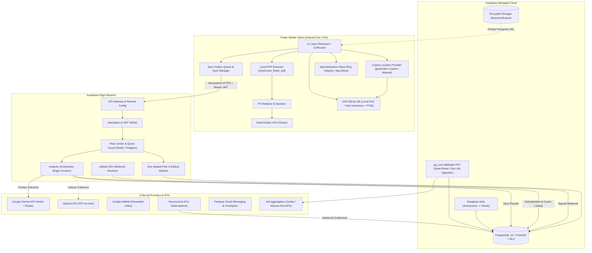

---

### 2.2 Component Responsibilities

*   **Flutter Mobile Client:** Interactive client and offline cache. Obtains coarse device location (approximate city/district level), performs deterministic PDF parsing, strips sensitive personal information (SPI) locally, runs instantaneous rule-based ATS checks, and computes offline distance to jobs using SQLite Haversine.
*   **Drift SQLite DB:** Client-side source of truth. Contains `Jobs` with precomputed latitude/longitude, `Resumes`, `Applications`, and `OutboxQueue`. Computes proximity rankings offline without internet access.
*   **Supabase PostgreSQL + PostGIS:** Central relational and spatial database. Enabled with `postgis` extension to perform index-accelerated radial queries (`ST_DWithin` using geography points) for sub-millisecond filtering across thousands of nationwide listings.
*   **Supabase Edge Functions:** Zero-trust secure intermediary. Handles external API keys, verifies Play Integrity attestation, enforces daily quota limits, runs prompt assemblies, and filters location queries.
*   **External AI Services:** Stateless inference engines (Gemini Flash & GPT-4o-mini) bound by zero-data-retention terms.
*   **Job Ingestion Service:** Scheduled daily edge job pulling geo-tagged listings from Jooble and Adzuna APIs for key Philippine growth hubs.

---

## 3. End-to-End Flows & Sequence Diagrams

### 3.1 First Launch, Location Setup & Anonymous Auth

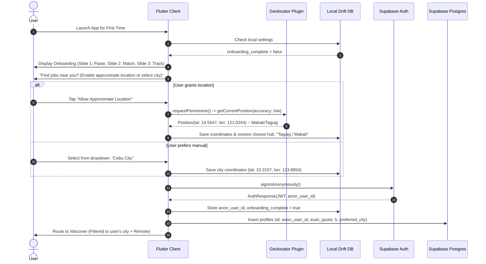

---

### 3.2 Location-Based Job Discovery & Proximity Ranking ("Near Me")

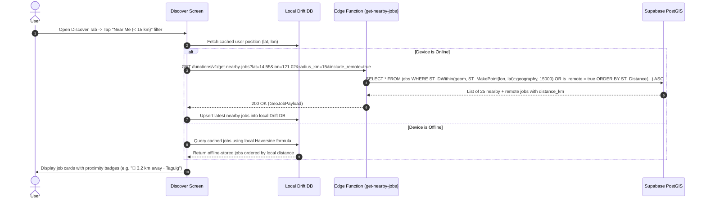

---

### 3.3 Resume Upload, On-Device Parsing, ATS Check & Sync

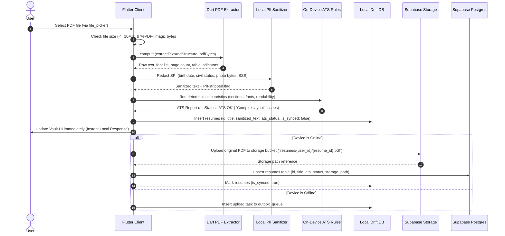

---

### 3.4 Analysis Request (Online Flow)

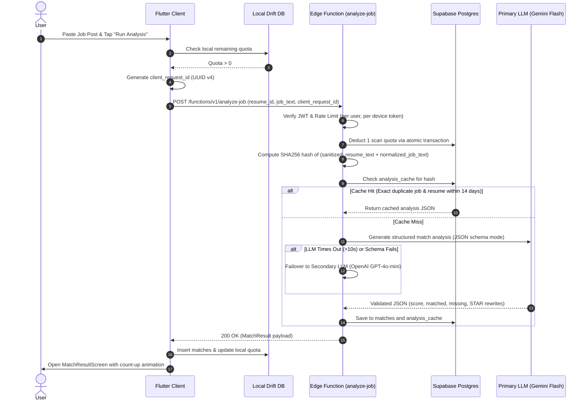

---

### 3.5 Analysis Request (Offline Flow)

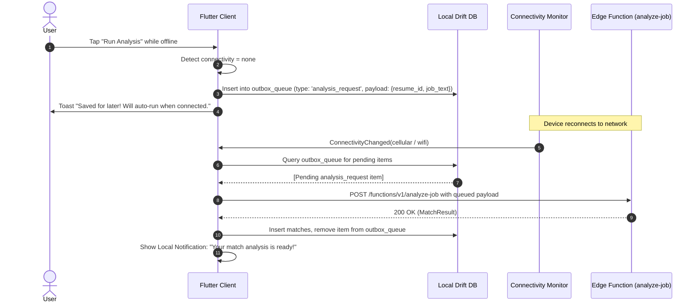

---

### 3.6 Share-Intent Entry from Social / Job Boards

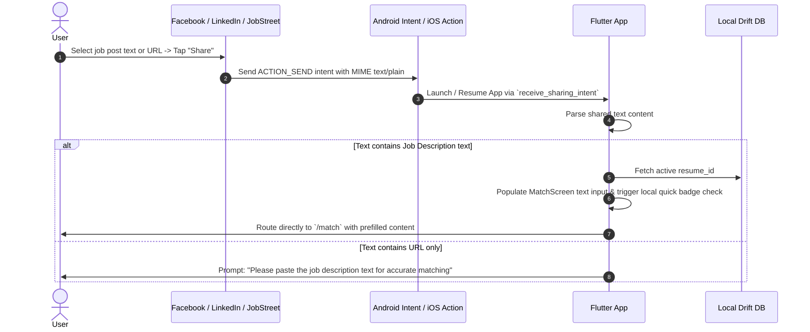

---

### 3.7 Tracker Kanban: Notes Autosave & Status Changes

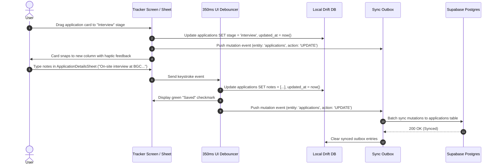

---

### 3.8 Rewarded Ad -> Extra Scan (Server-Side Verification)

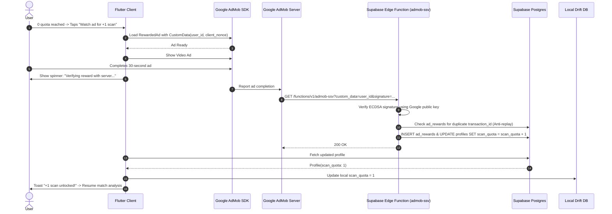

---

### 3.9 Account Deletion & Data Purge (DPA Compliant)

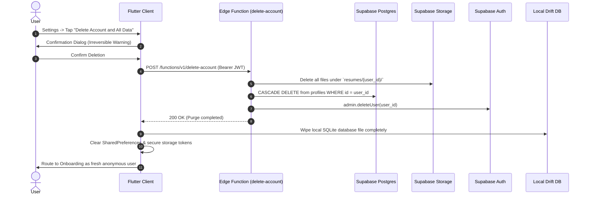

---

## 4. Location Engine & Proximity Discovery Architecture

### 4.1 The Philippine Commute Challenge & Location Strategy

*   **The Urban Reality:** In Metro Manila, Metro Cebu, and Metro Davao, a commute of 12 kilometers (e.g. from Quezon City to BGC, or Lapu-Lapu to Cebu IT Park) can take between **1.5 to 3 hours each way** via jeepneys, MRT, and UV Express. For entry-level BPO agents and junior developers, a job's physical proximity directly impacts their daily cost of living, sleep, and job retention.
*   **Architectural Response:** Proximity is treated as a **first-class ranking and discovery metric**, side-by-side with skill alignment.

---

### 4.2 Privacy-Preserving Location Architecture

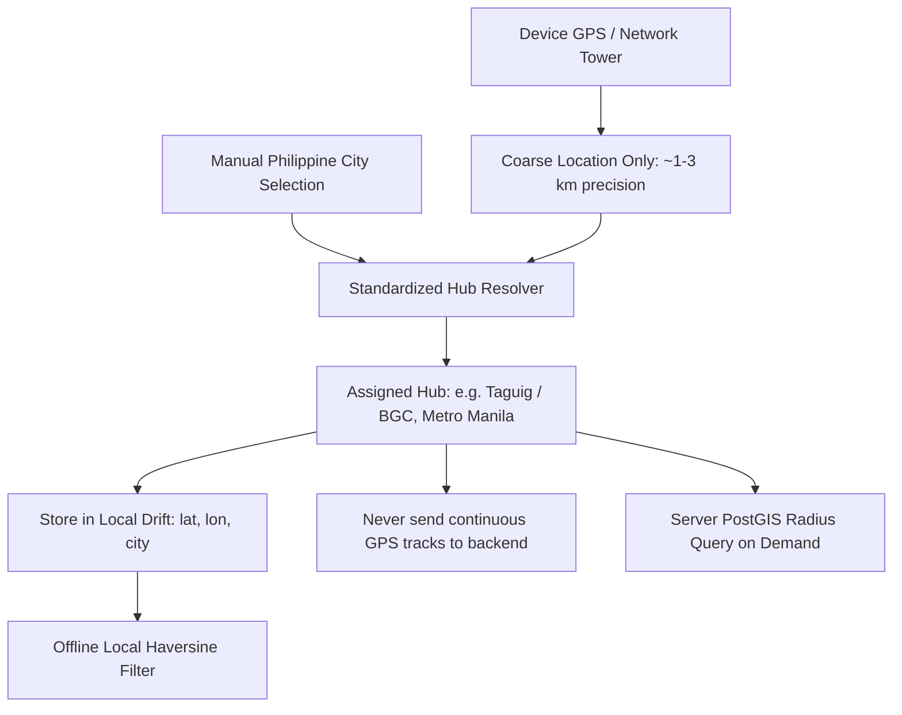

#### Core Principles
1.  **Coarse Location Only (`ACCESS_COARSE_LOCATION` on Android):** The app never requests fine-grained background GPS (`ACCESS_FINE_LOCATION`). Coarse location provides ~1–3 km accuracy, sufficient for city/district proximity while consuming virtually zero battery and maintaining compliance with Section 11 of the Philippine Data Privacy Act (Proportionality & Data Minimization).
2.  **No Continuous Tracking:** Coordinates are captured only when opening the Discover tab or changing location settings. The backend never records a location history log.
3.  **Manual Fallback Dropdown:** Users can decline location permissions entirely and pick from 18 standardized Philippine tech/BPO clusters.

---

### 4.3 Standardized Philippine Tech & BPO Geo-Clusters

| Region / Cluster | Center Coordinates (Lat, Lon) | Major Tech/BPO Sub-Districts | Typical Radius |
| :--- | :--- | :--- | :--- |
| **BGC / Taguig & Makati** | `14.5547, 121.0244` | Bonifacio Global City, Ayala Ave, McKinley Hill | 10 km |
| **Ortigas / Pasig & Mandaluyong** | `14.5866, 121.0614` | Ortigas Center, Greenfield, Pioneer | 10 km |
| **Quezon City (North)** | `14.6507, 121.0345` | UP-Ayala Technohub, Eastwood Libis, Cubao | 15 km |
| **Alabang / Muntinlupa (South)** | `14.4226, 121.0392` | Filinvest City, Madrigal Business Park | 15 km |
| **Metro Cebu** | `10.3157, 123.8854` | Cebu IT Park, Cebu Business Park, Mandaue | 20 km |
| **Metro Davao** | `7.0731, 125.6128` | Lanang IT Park, Matina, Bajada | 20 km |
| **Clark / Angeles (Pampanga)** | `15.1788, 120.5332` | Clark Freeport Zone, Angeles Tech District | 25 km |
| **Iloilo City** | `10.7202, 122.5621` | Iloilo Business Park (Megaworld), Mandurriao | 15 km |
| **Bacolod & Cagayan de Oro** | `10.6765, 122.9509` / `8.4542, 124.6319` | Lacson IT Hub / Pueblo de Oro IT Park | 20 km |
| **Remote (Nationwide)** | `NULL, NULL` (Special flag: `is_remote = true`) | Eligible across all user coordinates | Global |

---

### 4.4 Spatial Queries: Cloud (PostGIS) vs Local (Drift Haversine)

#### 1. Server-Side PostGIS Radial Query
Supabase PostgreSQL leverages PostGIS with a spatial index (`GIST`) over the geography point column:
*   **Table Definition:** `jobs.geom GEOGRAPHY(Point, 4326)`
*   **Spatial Index:** `CREATE INDEX idx_jobs_geom ON jobs USING GIST (geom);`
*   **Radius Query Execution:**
    ```sql
    -- Executed in Supabase Edge Function: get-nearby-jobs
    SELECT id, role, company, location, city, is_remote,
           ROUND((ST_Distance(geom, ST_MakePoint(user_lon, user_lat)::geography) / 1000)::numeric, 1) AS distance_km
    FROM public.jobs
    WHERE ST_DWithin(geom, ST_MakePoint(user_lon, user_lat)::geography, radius_meters)
       OR (include_remote IS TRUE AND is_remote IS TRUE)
    ORDER BY is_remote ASC, distance_km ASC
    LIMIT 30;
    ```

#### 2. Local-First Offline Haversine Math (Drift SQLite)
When offline or on flaky mobile data, the app calculates distances locally inside Drift:
*   Drift stores `latitude` and `longitude` on the local `Jobs` table.
*   A pure Dart Haversine utility computes distance:
    $$\Delta \sigma = 2 \arcsin \left( \sqrt{\sin^2\left(\frac{\Delta \phi}{2}\right) + \cos(\phi_1)\cos(\phi_2)\sin^2\left(\frac{\Delta \lambda}{2}\right)} \right)$$
    $$\text{distance} = R \times \Delta \sigma \quad (R = 6,371 \text{ km})$$
*   Jobs are filtered and sorted instantly on-device without network latency.

---

### 4.5 Discover Screen UI Integration

```
┌────────────────────────────────────────────────────────┐
│  Discover                           [Filter: Tune Icon] │
│  [ Search role, company, or location...             ] │
│                                                        │
│  [Near Me (< 15 km) ✓] [Remote] [BPO] [Frontend]       │
│                                                        │
│  Recommended for you (18)       Current: Taguig / BGC  │
│ ┌────────────────────────────────────────────────────┐ │
│ │ Junior Flutter Developer           [ 85% Match ]   │ │
│ │ Northwind Digital · 📍 3.2 km away · Taguig        │ │
│ │ Hybrid · PHP 35k-45k / month                       │ │
│ └────────────────────────────────────────────────────┘ │
│ ┌────────────────────────────────────────────────────┐ │
│ │ Technical Support Associate        [ 78% Match ]   │ │
│ │ Kapitan Tech · 📍 6.1 km away · Makati             │ │
│ │ On-site · PHP 28k-35k / month                      │ │
│ └────────────────────────────────────────────────────┘ │
│ ┌────────────────────────────────────────────────────┐ │
│ │ Mobile QA Trainee                  [ Tap to Match ]│ │
│ │ CloudScale Solutions · 🌐 Remote                   │ │
│ │ Remote · PHP 30k-38k / month                       │ │
│ └────────────────────────────────────────────────────┘ │
└────────────────────────────────────────────────────────┘
```

---

## 5. AI & Third-Party API Selection

### 5.1 LLM Comparison Matrix

*Baseline verification date: October 2026. Pricing per 1M tokens.*

| Dimension | Google Gemini Flash | OpenAI GPT-4o-mini | Claude 3.5 / 4.5 Haiku | DeepSeek V3 / Groq |
| :--- | :--- | :--- | :--- | :--- |
| **Input Price / 1M** | **$0.15 - $0.75** | **$0.15** | $0.80 - $1.00 | $0.05 - $0.14 |
| **Output Price / 1M**| **$0.60 - $3.75** | **$0.60** | $4.00 - $5.00 | $0.20 - $0.28 |
| **Structured JSON** | **Excellent (Native)** | **Exceptional** | Good | Moderate |
| **Resume Rewrite Quality**| **Strong** | **Strong** | **Superior** | Moderate |
| **Taglish Handling**| **Outstanding** | **Strong** | Strong | Weak |
| **P95 Latency** | **Fast (~1.0s)** | Fast (~1.1s) | Fast (~1.4s) | Ultra-fast (~0.5s)|
| **Free Tier Available**| **Yes (15 RPM / 1.5k RPD)**| No public free tier | No | Limited free tier |
| **Privacy Terms** | Zero retention (Paid key)| Zero training | Zero training | Varies |

*   **Primary:** Google Gemini Flash (best Taglish, lowest cost, sub-second latency).
*   **Fallback:** OpenAI GPT-4o-mini (circuit-breaker failover).
*   **Escalation:** Claude 3.5 Sonnet (Pro tier full resume rewrites only).

---

### 5.2 Third-Party Services Selection

| Capability | Recommended Provider | Pricing / Limits (Oct 2026) | Justification & Legal Assessment |
| :--- | :--- | :--- | :--- |
| **Geo-Location** | **`geolocator` (Coarse)** | Free / Open Source | Built-in Android/iOS low-accuracy cellular/Wi-Fi positioning. |
| **Job Aggregators** | **Jooble API & Adzuna API** | Free developer tiers (2.5k calls/mo) | Official developer APIs with location radius support. 100% legal. |
| **PDF Parsing** | **On-Device (Dart)** | Free (`syncfusion_flutter_pdf` Community) | Offline, zero server egress, zero PII leak risk. |
| **Rewarded Ads** | **Google AdMob** | PH rewarded video eCPM: ~$0.80 - $2.50 | Standard in the Philippines; supports Server-Side Verification (SSV). |
| **In-App Billing** | **RevenueCat** | Free up to $2.5k monthly tracked revenue | Simplifies store receipt validation and Pro entitlements. |
| **Push & Crash** | **Firebase FCM + Crashlytics** | Free (Unlimited) | Standard Flutter integration, zero-cost reliability. |

---

### 5.3 Cost Projections Table

*Assumptions: 1,200 input tokens, 600 output tokens per scan. Gemini Flash blended cost = $0.00054 per scan.*

| Metric / Service | 100 MAU | 1,000 MAU | 10,000 MAU | 100,000 MAU |
| :--- | :--- | :--- | :--- | :--- |
| **Total Scans / Month** | 1,500 | 15,000 | 150,000 | 1,500,000 |
| **LLM Cost (Gemini Flash)**| $0.81 | $8.10 | $81.00 | $810.00 |
| **Supabase Hosting** | $0.00 (Free) | $0.00 (Free) | $25.00 (Pro) | $75.00 (Pro + Compute) |
| **Edge Invocations** | $0.00 (<500k) | $0.00 (<500k) | $0.00 (<500k) | $20.00 (Overage) |
| **AdMob Revenue (Est. PH)** | +$1.80 | +$18.00 | +$180.00 | +$1,800.00 |
| **Pro Subscriptions (2% conv.)**| +$5.00 | +$50.00 | +$500.00 | +$5,000.00 |
| **Net Operational Profit** | **+$5.99** | **+$59.90** | **+$574.00** | **+$5,776.00** |

---

## 6. ATS Scanner & Suggestions Architecture

### 6.1 Clear Recommendation: Should You Build It?
**Recommendation: YES, as a dual-engine architecture: Deterministic On-Device Rule Engine + AI Content Tailoring Engine.**

### 6.2 Deterministic Local Checks vs AI Suggestions
*   **Deterministic Local Checks (100% On-Device):**
    1.  *Extractability:* Fails if extracted text is <100 characters (scanned image PDF).
    2.  *Section Parsing:* Checks for standard headings (`Summary`, `Experience`, `Education`, `Skills`).
    3.  *Layout Simplicity:* Flags complex multi-column tables and text frames.
    4.  *Contact Essentials:* Regex checks for email and Philippine mobile phone number (`+63` / `09xx`).
    5.  *Page Length:* Warns if page count > 2 for fresh graduates.
*   **AI Suggestions Engine (Cloud Gateway):**
    1.  Missing domain keywords.
    2.  STAR bullet rewrites (Situation, Task, Action, Result).
    3.  Action verb strengthening.

### 6.3 Scoring Model Harmonization
*   **Quick Match Badge (Local Heuristic):** Labeled as **"Keyword Match"** (lexical term overlap).
*   **In-Depth Match Result (AI Analysis):** Labeled as **"Role Fit Score"**.
*   **Harmonized Formula:**  
    $$\text{Overall Role Fit} = (0.35 \times \text{Keyword Match}) + (0.35 \times \text{Experience Alignment}) + (0.30 \times \text{Technical Depth})$$

---

## 7. Database & Data Architecture

### 7.1 Database Entity Relationship Diagram

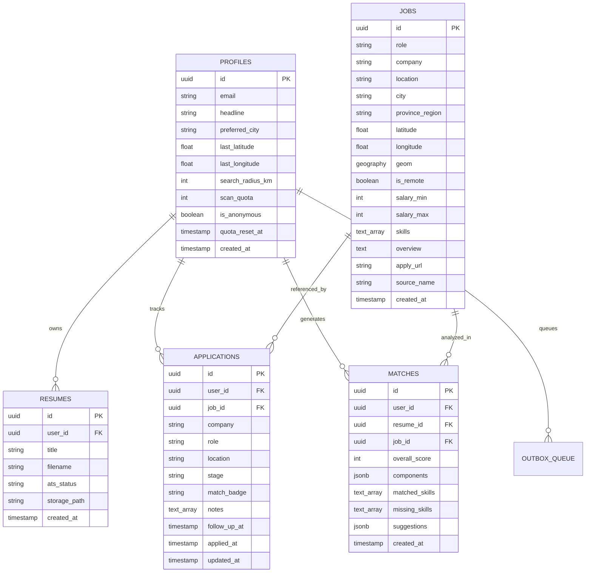

---

### 7.2 Data Tiering & Hygiene

| Data Element | Storage Location | Retention / Policy | Hygiene & Privacy Rule |
| :--- | :--- | :--- | :--- |
| **Raw Resume PDF** | Local Device + Private Supabase Storage | Retained until user deletes resume | User-isolated RLS storage bucket. |
| **Raw Resume Text** | Local SQLite DB (Drift) only | Device lifecycle | **Never stored in cloud database.** Sent in-flight to Edge Function memory and purged. |
| **Coarse Location** | Local Drift DB + User Profile | Ephemeral / Active setting | Only stores latest city/approximate coordinate. No movement tracking. |
| **PII & Contact Info** | Local Device only | Local profile | Stripped before LLM ingestion. Never logged. |
| **Match Analysis JSON**| Local Drift DB + Server `matches` table | 90 days server retention | Scores, keyword lists, and STAR rewrites only. |
| **Tracker Notes** | Local Drift DB + Server `applications` table| User lifecycle | Encrypted in transit (TLS 1.3) and at rest (AES-256). |

---

## 8. Offline-First Synchronization Architecture

### 8.1 Offline Capability Matrix

| Feature | Offline Behavior | Online Behavior | Sync Trigger |
| :--- | :--- | :--- | :--- |
| **Discover (Near Me)**| Calculates distance locally via SQLite Haversine | Fetches latest nearby jobs via PostGIS `ST_DWithin` | Pull-to-refresh or launch |
| **Vault (Resumes)** | Extracts text locally, runs local ATS check | Uploads PDF to storage, syncs metadata | Immediate or upon reconnect |
| **Match Analysis** | Queues job post and resume in local outbox | Executes full LLM analysis via Edge Function | Auto-runs upon reconnect |
| **Tracker (Kanban)** | Fully functional: move stages, edit notes | Pushes mutations to Supabase PostgreSQL | Instant background sync |
| **Mock Interview** | Local transcript review and question practice | AI Evaluation & scoring of complete transcript | User-triggered when online |

---

### 8.2 Conflict Resolution Rules

*   **Applications (Tracker):** Last-Write-Wins (LWW) based on `updated_at`.
*   **Application Notes:** Append-only field merge prevents lost notes during multi-device edits.
*   **Scan Quota:** Server-authoritative ledger prevents double-spend or local clock manipulation.
*   **Deletions:** Soft deletes via `deleted_at` tombstones synced to cloud to purge across devices.

---

## 9. Scalability, Cost & Performance Controls

### 9.1 Multi-Layer Rate Limiting & Abuse Prevention

```mermaid
flowchart TD
    REQ[Client API Request] --> L1[Layer 1: IP Rate Limiting (60 req/min)]
    L1 -->|Pass| L2[Layer 2: Play Integrity / App Attest Check]
    L2 -->|Pass| L3[Layer 3: User Quota Ledger Check]
    L3 -->|Pass| L4[Layer 4: Anonymous Account Device Cap (Max 5 Scans)]
    L4 -->|Pass| EXEC[Execute Edge Function]
```

*   **Midnight Manila Quota Reset:** Executed via PostgreSQL `pg_cron` at 00:00 Asia/Manila (16:00 UTC):
    ```sql
    SELECT cron.schedule('manila_midnight_quota_reset', '0 16 * * *', $$
      UPDATE public.profiles SET scan_quota = 5, quota_reset_at = NOW() WHERE scan_quota < 5;
    $$);
    ```

---

### 9.2 Caching Strategy

*   **Exact Match Cache:** `SHA256(resume_text + job_text)` stored in `analysis_cache` (14-day TTL, ~25% hit rate).
*   **Job Geocoding Cache:** Standardized coordinates cached for 18 Philippine hubs, eliminating redundant geocoding API calls.
*   **Local Drift Cache:** 100% cache hit for repeat viewings of previously loaded jobs, tracker cards, and match reports.

---

## 10. Security, Privacy & Philippine Legal Compliance

### 10.1 Top 10 Threat Model & Mitigations

1.  **Prompt Injection:** Fenced delimiters (`<<<JOB_POST>>>`), strict JSON schema outputs, and instruction override rejection.
2.  **Malicious PDFs:** Isolated Dart background worker (`compute()`), 10MB limit, `%PDF-` header signature check.
3.  **API Key Exposure:** Zero external API keys in Flutter client. Secrets live strictly inside Supabase Edge Function environment variables.
4.  **IDOR:** Row-Level Security (RLS) enforced on every table: `USING (auth.uid() = user_id)`.
5.  **Replayed Ad Rewards:** AdMob SSV cryptographic ECDSA verification with unique transaction ID constraints.
6.  **SPI Exposure / Bias:** Client-side regex scrubber removes birthdates, marital status, religion, photos, and SSS/TIN.
7.  **Location Stalking / Tracking:** Zero high-precision GPS tracking; app only captures coarse city-level coordinates.
8.  **Token Exhaustion / DoS:** Inputs clamped to 4,000 characters (job) and 6,000 characters (resume) at gateway.
9.  **Bot Farm Scraping:** Play Integrity API attestation required for analysis and reward redemption.
10. **Data Leakage to AI:** Paid API keys with zero data training terms, plus client-side anonymization.

---

### 10.2 Philippine Data Privacy Act of 2012 (RA 10173) Compliance

*   **Sensitive Personal Information (SPI) Scrubbing:**
    *   Age / Birthdate regex: `(Age|Birthdate|DOB|Date of Birth)\s*[:\-]?\s*.*` -> `[REDACTED]`
    *   Civil Status regex: `(Civil Status|Marital Status|Religion|Citizenship)\s*[:\-]?\s*.*` -> `[REDACTED]`
    *   Government IDs: SSS (`\d{2}-\d{7}-\d`), PhilHealth, Pag-IBIG, TIN -> `[REDACTED]`
*   **Consent Wording:** An explicit consent modal is presented on first launch explaining the use of anonymized text for matching and coarse location for proximity discovery.
*   **Data Subject Rights:** Built-in 1-click **"Delete Account and All Data"** that permanently purges cloud storage, database rows, auth records, and local SQLite data.

---

## 11. AI Quality & Guardrails

*   **"Never Fabricate Experience" Rule:** System prompts strictly forbid inventing employers, certifications, or metrics not grounded in the candidate's original text. If a metric is missing, the model outputs bracketed placeholders like `[X%]`.
*   **Evaluation Set:** CI/CD automated regression suite with **40 curated Philippine job-resume pairs** (15 BPO/Support, 15 Entry Tech, 10 General) tested on every prompt or model update.
*   **Quality Thresholds:** 100% JSON schema compliance, 0% invented credentials, >= 4.5/5.0 Taglish naturalness rating.

---

## 12. Observability, Telemetry & Operations

*   **Structured Logs:** Edge Functions emit JSON logs with `latency_ms`, `tokens_in`, `tokens_out`, `status_code`, and `cache_hit`. **Resume text and candidate names are never written to logs.**
*   **Alerting Triggers:** Automated alerts to Discord/Slack if P95 latency > 3.0s, error rate > 2%, or daily AI spend spikes above $10.
*   **Remote Config Flags:** Controlled via `app_config` table: `min_supported_version`, `llm_primary_provider`, `enable_rewarded_ads`, `default_search_radius_km`.

---

## 13. Monetization Plumbing & Unit Economics

*   **Free Daily Quota:** 5 scans/day resetting at midnight Manila time.
*   **Rewarded Ad Cap:** Maximum 3 rewarded video scans/day.
*   **Philippine Market Ad Economics:**
    *   AdMob Rewarded Video eCPM (PH): **~$1.50** ($0.0015 / view = ₱0.084 PHP).
    *   Gemini Flash Scan Cost: **$0.00054** (₱0.030 PHP).
    *   **Gross Margin on Ad Scan:** **+64%** (profitable from Day 1).
*   **Pro Subscription:** ₱149/month ($2.65 USD). Covers 50+ monthly scans with >98% gross profit margin.

---

## 14. Phased Roadmap for a Solo Student Developer

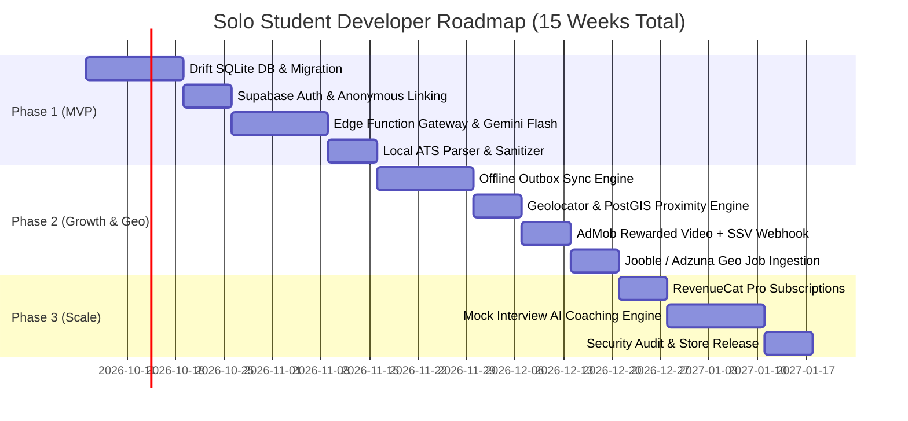

---

## 15. Risk Register & Unanswered Questions

### 15.1 Risk Register

| Risk Event | Likelihood | Impact | Concrete Mitigation |
| :--- | :---: | :---: | :--- |
| **1. Supabase Free Tier Inactivity Pause** | High | High | Free external ping (Cron-Job.org / GitHub Actions) every 72 hours. Upgrade to Pro ($25/mo) at 1k MAU. |
| **2. User Declines Location Permission** | High | Low | Graceful fallback to manual dropdown selection of 18 Philippine hubs; defaults to "Nationwide / Remote". |
| **3. AdMob Account Suspension (Invalid Traffic)**| Medium | High | Enforce Server-Side Verification (SSV) and cap rewarded ads to 3 per user per day. |
| **4. Unscannable Image-Only PDFs Uploaded**| High | Low | On-device check alerts user immediately with guidance on exporting clean text PDFs from Canva/Word. |
| **5. Student Budget Overrun (> $50/mo)**| Low | High | Set hard billing limits of $10.00 on Google AI Studio / GCP billing consoles. |

---

## 16. Additional Required Sections (A through G)

### A. Constraints & Dual-Path Architecture

*   **Developer Profile:** Solo student developer with 10–15 hours/week.
*   **Hard Budget Ceiling:** $0 during development; strictly under $50/month for the first 1,000 MAU.
*   **Target Devices:** Mid-range Android smartphones first (Infinix, Redmi, Realme), followed by iOS.

#### Plan 1: The "Cheapest Viable Path" ($0 – $5 / month)
*   **Host:** Supabase Free Tier (500MB DB, 1GB Storage, 50k Auth MAU, 500k Edge Functions) with automated 72-hour health ping.
*   **LLM:** Google Gemini Flash via Google AI Studio free tier key (1,500 requests/day free, with PII scrubbed client-side).
*   **Geo:** Coarse on-device location (`geolocator`) + Drift SQLite Haversine calculations.
*   **Jobs:** 200 curated Philippine tech/BPO jobs + Jooble API free tier.
*   **Monetization:** 3 free scans/day + AdMob Rewarded Video ads (SSV enabled).
*   **Total Out-of-Pocket:** **$0.00 / month**.

#### Plan 2: The "Recommended Growth Path" ($25 – $45 / month)
*   **Host:** Supabase Pro Tier ($25/month). Guarantees zero project pauses, daily automated backups, 8GB database, PostGIS spatial indexing.
*   **LLM:** Gemini Flash Primary + OpenAI GPT-4o-mini Fallback with automated circuit-breaker switching.
*   **Jobs:** Jooble API + Adzuna API geo-ingestion cron job running daily.
*   **Monetization:** AdMob Rewarded Ads + RevenueCat Pro Subscriptions (₱149/month).
*   **Total Out-of-Pocket:** **$25.00 to $45.00 / month**.

*Trigger to switch from Plan 1 to Plan 2: Reaching 800 MAU or when monthly ad revenue exceeds $50.00.*

---

### B. Deep-Dive Architecture Topics

#### B.1 API Versioning & Backwards Compatibility
*   **Endpoints:** Structured as `/functions/v1/analyze-job` and `/functions/v1/get-nearby-jobs`.
*   **Soft/Hard Updates:** `app_config` table supplies `min_supported_version`. If installed app build is below threshold, a non-dismissible modal prompts the user to update from the Google Play Store.

#### B.2 App Attestation & Bot Protection
*   **Android:** Google Play Integrity API standard tier (free up to 10k requests/day). Edge functions verify that requests originate from legitimate, non-emulated Play Store builds before granting scan tokens.

#### B.3 Migration Plan from `job_matcher_demo_v1`
*   Upon launch, a migration runner checks if `SharedPreferences` contains `job_matcher_demo_v1`.
*   If found, it deserializes the JSON blob into Drift SQLite tables (`resumes`, `applications`, `matches`).
*   Renames the key to `job_matcher_demo_v1_migrated_backup` to prevent re-running while preserving a local rollback copy.

#### B.4 Vendor Lock-in & Exit Plan
*   **Database:** Supabase is open-source PostgreSQL. Exportable via `pg_dump` to AWS RDS or a $5 VPS in under 2 hours.
*   **LLM Gateway:** Standardized TypeScript adapter pattern allows swapping Gemini for Claude or local Llama 3 with zero client changes.

#### B.5 Backup & Disaster Recovery
*   **Free Path:** Weekly GitHub Actions cron job executes `pg_dump` and stores an encrypted backup on Google Drive.
*   **Pro Path:** Daily automated Point-in-Time Recovery (PITR) backups retained for 7 days.

---

### C. Philippines-Specific & Fairness Engineering

#### C.1 Eliminating Hiring Bias in Philippine Resumes
*   Philippine CVs often contain age, civil status, religion, photos, and SSS/TIN.
*   The on-device parser redacts these fields prior to cloud transmission to prevent algorithmic discrimination (e.g. against older graduates, married applicants, or specific regional affiliations).

#### C.2 Taglish & Filipino Quality Testing Plan
*   Dedicated regression suite containing 20 Taglish interview answers.
*   Validates that the LLM comprehends colloquial phrasing (*"Nag-maintain ako ng server para iwas-crash"*) while suggesting professional, metric-driven STAR English rewrites.

#### C.3 Sourcing Risk & Intellectual Property
*   Zero direct scraping of JobStreet, Kalibrr, or LinkedIn.
*   Jobs are aggregated strictly via official partner developer APIs (Jooble/Adzuna) with full source attribution and direct link-out to the employer's official job portal.

---

### D. Product Feature Evaluations (Keep / Defer / Cut)

| Feature | Cost to Build | Value to User | Recommended Decision | Build Order / Rationale |
| :--- | :---: | :---: | :---: | :--- |
| **Location Proximity ("Near Me")**| **Low** | **Critical** | **KEEP (MVP)** | Solves the 2–3 hour commute burden for Filipino workers. Powered by coarse geo + PostGIS. |
| **Follow-up Reminders** | **Very Low** | **Very High** | **KEEP (MVP)** | On-device local notifications 24h before scheduled interview. $0 cloud cost. |
| **Duplicate & Stale Job Detection**| **Low** | **High** | **KEEP (Phase 2)**| Flags listings older than 30 days using company + role signature hashing. |
| **Tailored Resume PDF Export** | **Moderate** | **High** | **DEFER (Phase 3)** | High cross-device layout complexity. Defer until core matching is proven. |
| **Cover Letter Generator** | **Low** | **Moderate** | **DEFER (Phase 3)** | Moderate token consumption; can serve as a Pro subscription perk. |
| **Salary Insights for PH Roles** | **Very High** | **High** | **CUT** | No granular open salary API exists for the Philippines. Replace with broad DOLE survey bands. |

---

### E. Comprehensive Testing Strategy

*   **Offline Geo Testing:** Verify that "Near Me" filters jobs using local Haversine calculations in airplane mode without crashing.
*   **Flaky Network Testing:** Simulate high latency (2G/3G) and mid-sync kills to ensure the outbox queue handles retries idempotently.
*   **AI Regression Suite:** Run 40 golden resume-job pairs against the LLM gateway before deploying prompt modifications.

---

### F. Unit Economics: Ad Revenue vs Pro Subscriptions

*   **AdMob Rewarded Video eCPM (PH):** **$1.50** ($0.0015 / completed view = ₱0.084 PHP).
*   **Gemini Flash Scan Cost:** **$0.00054** (₱0.030 PHP).
*   **Net Profit per Ad-Funded Scan:** **+$0.00096 USD (64% gross margin)**.
*   **Pro Subscription:** ₱149/month ($2.65 USD). 1.2% conversion rate covers all server and infrastructure expenses.
*   **Sustainable Free Quota:** 5 free scans/day + 3 rewarded ad scans/day is financially sustainable indefinitely.

---

### G. Architecture Decision Records (ADRs)

#### ADR 01: Supabase Managed Backend Selection
*   **Context:** Solo student developer needs managed PostgreSQL, PostGIS spatial queries, Auth, and Edge compute under $50/mo.
*   **Options:** Supabase Managed, Firebase Firestore, Custom Node/VPS.
*   **Decision:** Adopt Supabase Managed.
*   **Confidence:** High.
*   **What Would Change Mind:** If Supabase removes its free tier before the app generates revenue.

#### ADR 02: Coarse Geo-Location with Local Haversine Fallback
*   **Context:** Show jobs near the candidate while minimizing battery drain, preserving privacy under RA 10173, and supporting offline usage.
*   **Options:** High-precision continuous GPS, Coarse Location + PostGIS/Haversine, Manual dropdown only.
*   **Decision:** Coarse location (`geolocator` Coarse) backed by PostGIS `ST_DWithin` and local Drift Haversine.
*   **Confidence:** High.
*   **What Would Change Mind:** If Philippine users demand turn-by-turn commute routing inside the app.

#### ADR 03: Drift (SQLite) as Single Source of Truth
*   **Context:** Need offline relational persistence, spatial Haversine distance, and reactive Riverpod stream bindings.
*   **Options:** Drift, Isar, SharedPreferences.
*   **Decision:** Migrate from SharedPreferences blob to Drift SQLite.
*   **Confidence:** High.
*   **What Would Change Mind:** If Flutter deprecates SQLite bindings.

#### ADR 04: Google Gemini Flash Primary LLM Gateway
*   **Context:** Sub-second structured JSON output with strong Taglish comprehension at minimal token cost.
*   **Options:** Gemini Flash, OpenAI GPT-4o-mini, Claude 3.5 Haiku.
*   **Decision:** Use Gemini Flash with GPT-4o-mini fallback.
*   **Confidence:** High.
*   **What Would Change Mind:** If Google forces data training on paid API keys.

#### ADR 05: Server-Side Verification (SSV) for AdMob Rewards
*   **Context:** Prevent modified client APKs from forging ad completion callbacks for free scans.
*   **Options:** AdMob Server-Side Verification (SSV), Client-only SDK callback.
*   **Decision:** Enforce server-side cryptographic ECDSA verification via Supabase Edge Function.
*   **Confidence:** High.
*   **What Would Change Mind:** If AdMob deprecates SSV webhooks.

---

## 17. One-Page Week-by-Week Build Order Checklist

```markdown
### Week 1: Local Foundation & Database Schema
- [ ] Add `drift: ^2.20.0`, `sqlite3_flutter_libs`, and `drift_dev` to pubspec.yaml.
- [ ] Define Drift tables: `Resumes`, `Applications`, `Matches`, `Jobs`, `OutboxQueue`.
- [ ] Write migration script in `lib/data/` transitioning `job_matcher_demo_v1` SharedPreferences to Drift.
- [ ] Add Dart Haversine distance utility function to calculate distance between coordinates offline.

### Week 2: Supabase Project Setup & Auth Plumbing
- [ ] Create Supabase project in Asia-Southeast (Singapore) region; run `CREATE EXTENSION postgis;`.
- [ ] Deploy database tables with Row-Level Security (RLS) and PostGIS GIST spatial index on `jobs.geom`.
- [ ] Configure `pg_cron` schedule for Manila Midnight Quota Reset (00:00 PHT).
- [ ] Implement Anonymous Auth in Flutter; connect onboarding flow to permanent Google link.

### Week 3: Location Provider & Proximity Filtering
- [ ] Add `geolocator: ^13.0.0` to pubspec.yaml; configure coarse location permission in AndroidManifest.xml.
- [ ] Implement Riverpod `locationProvider` resolving coarse GPS coordinates or manual Philippine city choice.
- [ ] Deploy Supabase Edge Function: `get-nearby-jobs` performing radial `ST_DWithin` filtering.
- [ ] Add "Near Me (< 15 km)" filter chip and proximity distance badges (e.g. "📍 3.2 km away") in DiscoverScreen.

### Week 4: On-Device PDF Extraction & ATS Engine
- [ ] Integrate `syncfusion_flutter_pdf` inside a Dart background worker isolate (`compute()`).
- [ ] Implement local PII regex redactor (strip age, civil status, photo, SSS/TIN).
- [ ] Implement deterministic ATS rule engine (font check, length, heading checks, contact info).
- [ ] Connect Vault UI to save parsed resume text and ATS status directly into Drift.

### Week 5: Edge Functions & AI Gateway
- [ ] Scaffold Supabase Edge Function: `analyze-job`.
- [ ] Integrate Google Gemini Flash API using structured JSON schema output mode.
- [ ] Implement retry logic with exponential backoff and circuit-breaker failover to GPT-4o-mini.
- [ ] Enforce quota deduction and hash-based exact match caching in PostgreSQL.

### Week 6: Offline Outbox Queue & Sync Manager
- [ ] Implement Drift `OutboxQueue` table and background sync worker isolate.
- [ ] Wire offline match analysis requests to auto-queue when network is unreachable.
- [ ] Implement `ConnectivityPlus` listener triggering outbox flush on connection restoration.
- [ ] Add local notification alerting user when an offline analysis completes.

### Week 7: Rewarded Ads & Server-Side Verification (SSV)
- [ ] Integrate `google_mobile_ads` SDK for Android.
- [ ] Deploy Supabase Edge Function: `admob-ssv` with Google ECDSA public key verification.
- [ ] Connect zero-quota dialog in Match and Dashboard screens to trigger RewardedAd.
- [ ] Test anti-replay verification ensuring a transaction ID cannot be reused.

### Week 8: Job Feed Aggregator Ingestion & Hardening
- [ ] Set up Jooble API and Adzuna API accounts; store developer keys in Supabase Vault.
- [ ] Deploy scheduled Edge Function ingesting entry-level IT/BPO jobs tagged with Philippine geo-clusters.
- [ ] Implement Play Integrity token check on analysis and reward endpoints.
- [ ] Add explicit Philippine Data Privacy Act consent modal and 1-click account purge button.
- [ ] Submit production build to Google Play Console with finalized Data Safety declaration.
```
